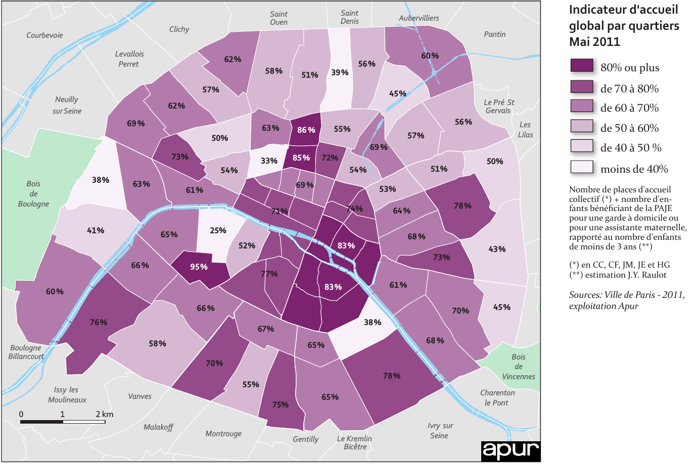
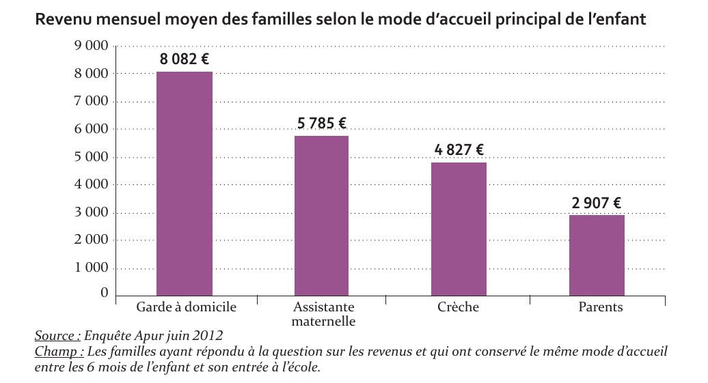

```{r setup, include=FALSE}
knitr::opts_chunk$set(echo = FALSE,
                      message = FALSE,
                      warning = FALSE,
                      fig.width = 10)
```

```{r packages}
library(tidyverse)
library(hrbrthemes)
```


## Les familles dans le 15e arrondissement

### Part des familles

Source : https://www.insee.fr/fr/statistiques/2020310?sommaire=2106091&geo=COM-75115

```{r}
df <- tribble(
  ~ catégorie, ~ `15e`, ~ Paris,
  "Hommes seuls", 24648, 244545,
  "Femmes seules", 40478, 341610,
  "Autres ménages sans famille", 6379, 62390,
  "Couple sans enfant", 25317, 215669,
  "Couple avec enfant(s)", 20682, 197719,
  "Famille monoparentale", 8745, 91885
)

df %>% 
  gather(territoire, nombre, `15e`:Paris) %>% 
  group_by(territoire) %>% 
  mutate(p = nombre / sum(nombre)) %>% 
  ggplot(aes(x = catégorie, y = p, group = territoire)) +
  geom_col(aes(fill = territoire), position = "dodge") +
  scale_fill_ipsum() +
  scale_y_percent() +
  coord_flip() +
  theme_ipsum(grid = "X")  +
  labs(title = "Le 15e arrondissement,\nun peu moins familial que la moyenne parisienne", 
       x = "", y = "Part des foyers",
       caption = "Source : INSEE, RP 2013.") +
  theme(legend.position = "bottom")
  
  
```

### Taille des familles

```{r}
df_taille <- tribble(
  ~ nb_enfants, ~ `15e`, ~ Paris,
  "Aucun enfant", 28106, 246048,
  "1 enfant", 12731, 124487,
  "2 enfants", 9728, 92708,
  "3 enfants", 3363, 33478,
  "4 enfants ou plus", 1090, 12258)

df_taille %>% 
  gather(territoire, nombre, `15e`:Paris) %>% 
  group_by(territoire) %>% 
  mutate(p = nombre / sum(nombre)) %>% 
  ggplot(aes(x = nb_enfants, y = p, group = territoire)) +
  geom_col(aes(fill = territoire), position = "dodge") +
  scale_fill_ipsum() +
  scale_y_percent() +
  coord_flip() +
  theme_ipsum(grid = "X")  +
  labs(title = "Un peu moins d'enfants dans le 15e", 
       x = "", y = "Part des familles",
       caption = "Source : INSEE, RP 2013.") +
  theme(legend.position = "bottom")
```

## Les modes de garde

Source : rapport APUR (http://www.apur.org/sites/default/files/documents/accueil_petite_enfance_paris.pdf)

D'après l'APUR, 75 % des enfants parisiens de moins de 3 ans, soit environ 56000 enfants, ont besoin d'être accueillis. 52 % des enfants de moins de 3 ans ont besoin d'être accueilli en mode collectif (crèche et autres), soit 38500 places. Elle peut monter jusqu'à 45500 places (61 %). 

L'offre d'accueil collectif publique concerne environ 32000 places à Paris (soit le meilleur ratio par enfants de France). Il existe également environ 4700 places dans des structures privées non subventionnées (dont des enfants non parisiens peuvent également bénéficier).

Il manque donc probablement entre 6500 et 12000 places. 

Il faut noter que d'après l'APUR, 42 % des parents dont l'enfant est accueilli en garde à domicile, et 63 % de ceux dont l'enfant est accueilli par une assistante maternelle, auraient préféré bénéficier d'un autre mode d'accueil (contre 3 % pour la crèche collective). 

Les capacités d'accueil sont par ailleurs inégalement réparties sur le territoire.



Le recours aux différents modes d'accueil est aussi très différencié selon les caractéristiques socioprofessionnelles des parents, et en particulier des mères.

```{r, fig.height=10}
df_garde <- tribble(
  ~ Indicateur, ~ `Crèche collective`, ~ `Garde à domicile`, ~ `Assistance maternelle`, ~ `Parents`,
  "Sans diplôme", 2.2, 1.1, 0, 28.3,
  "Bac +4", 65.2,  91.2, 73.7, 25.7,
  "Recherche d'emploi", 3, 0, 2.3, 13.8,
  "Temps plein", 67.9, 85.8, 73.1, 9.9,
  "Temps partiel", 26.9, 13.5, 19.2, 14.8,
  "Étranger", 9.1, 5.9, 9.7, 53.7,
  "Propriétaire", 38.8, 59.4, 31.1, 19,
  "HLM", 19.6, 2, 11.7, 24.2,
  "Famille monoparentale", 12.7, 1.9, 9.4, 9.3
)
df_garde %>% 
  gather(`Mode de garde`, part, -Indicateur) %>% 
  ggplot(aes(x = Indicateur, y = part)) +
  geom_col(aes(fill = Indicateur)) +
  scale_fill_ipsum() +
  facet_wrap(~ `Mode de garde`) +
  coord_flip() +
  theme_ipsum(grid = "X") +
  theme(legend.position = "bottom") +
  labs(title = "Des modes de garde très dépendant\ndes caractéristiques sociales", 
       x = "",
       y = "Part des mères recourant à ce mode de garde",
       caption = "Source : Enquête APUR 2012.")

```

